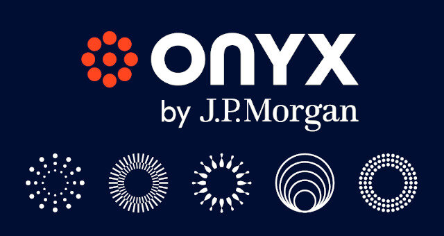
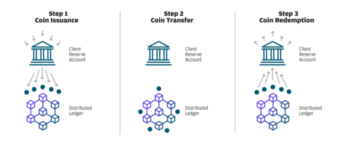

# JPM's Onyx Tackles International Payments with the Help of Blockchain  

 

## Overview and Origin

Name of company: 
- Onyx (firm under JPM umbrella for blockchain/digital currency initiatives [JPM Coin] and network provider Liink) 

https://www.youtube.com/watch?v=Sgw9zo4zvqA

Company Incorporated: 
- Oct. 2020 

Onyx Founders / Important Figures:
- Umar Farooq (CEO) 
- Christine Moy (Global Head of Liink, Onyx by JPM)
- Naveen Mallela (Global Head of Coin Systems, Onyx)
- Takis Georgakopoulos (JPM global head of wholesale payments)  

https://www.ledgerinsights.com/jpm-coin-goes-into-production-launches-jp-morgan-onyx-blockchain-unit/

How the company came about:

- There has been a trend of new FinTech firms which use tech to develop new channels in the financial system bipassing traditional banks. This is the case in domains such as lending, payments, investment management, insurance, and personal finance. As these startups develop a new peer-to-peer (P2P) system of doing business, traditional institutions must pivot and adopt some of this new technology in order to compete with these tech companies and startups.
- Onyx was created seperately from JPM the bank because it seemed appropriate that a new firm working towards new services and technologies should be run by a new company. This idea was taken from the start-up culture where talent is more attracted to revolutionary new industries and the rising companies in specific domains rather than established big corporations. An example of the reason for separating the two firms is the effect of JPM CEO Jamie Dimon's comments describing Bitcoin as a fraud, turning off many skilled tech employees. Although Dimon's skepticism of Bitcoin, it seems that he is not opposed to the technology Bitcoin is built on, such as cryptocurrencies and blockchain. On the Onyx website, Dimon describes Onyx as "the forefront of a major shift in the financial services indsutry. This new business unit reflects J.P.Morgan's commitment to innovation as we continue to build cutting-edge technology that delivers a better, faster and more inculsive financial system."   

How is the company funded? 

- The company, described by JPM CEO Jamie Dimon as a 'new business unit', was internally funded by it's parent company JPM. 
- It is unknown exactly how much funding was required to create and now operate Onyx. 

## Business Activities:

The financial problem Onyx is trying to solve:

- Pain Point = the current wholesale payment system is inefficient and leads to hundreds of millions of dollars in losses each year. 
- Onyx is trying to transition from the traditional methods of making payments to a technologically driven blockchain and cryptocurrency payment system.
- The current payment infrastructure must be updated because technology based advanced payment systems require programmability to create new complex upgrades. 
- Onyx's use of JPM Coin is reinforced by the reputation of JPM as being one of the largest and most stable international banks. This brings some relief to investors and clients as traditional banks try to implement a new technology. Therefore Onyx is in the unique position of revamping the current wholesale payments system.  

https://www.oliverwyman.com/our-expertise/insights/2018/oct/wholesale-payments--disrupt-from-within.html

Who is Onyx's intended customer? How big is the market? What is Onyx's 'unfair advantage' over competitors?

- Onyx is focusing their services for wholesale banking specifically in the payments department, with their intended customers being large institutional clients. PCM (wholesale payments and cash management) provide their instituional clients with solutions to facilitate payments to suppliers, collect funds from customers, and optimize their global cash and liquidity positions. 
- In 2017, PCM revenue was $250 billion. Partly due to the low costs associated with providing these services, returns on equity were from 20-40%.    
- As one of the major international financial institutions, JPM (through Onyx) is focusing on creating a 'first mover' advantage against other major banks to provide a service that only they can offer. 
- Onyx, because of it's connection to JPM, is able to get onboard the current institutions they provide services to and convince them to adopt the new system. This gives them an 'unfair advantage' against new firms trying to enter the market. 
- One of the most important advantages that Onyx has in comparison to new tech companies is the backing of JPM. Having such a reputable institution advancing in the field helps to settle investors fears about implementing a new technology, and that trust is what can lead to widespread adoption. 

https://www.bankingcircle.com/what-is-a-payments-api-119822#:~:text=Application%20Programming%20Interfaces%20(APIs)%20enable,and%20lower%20cost%20transaction%20processing.
https://www.jpmorgan.com/solutions/cib/news/digital-coin-payments

https://www.youtube.com/watch?v=Sgw9zo4zvqA

What are some of the technologies used by Onyx in order to reach their goals? 

- Cryptocurrencies through the development of JPM Coin which will allow payments to settle instantly in comparison to the current system which takes transactions days to settle. JPM Coin is helping  create a permissioned and shared account ledger for new 'payment rail' infrastructure. This will allow JPM clients to transfer USD held in deposit by JPM to facilitate real-time value movement to solve traditional cross-border payments.   
- Cloud computing tech providing clients access to storage, files, software, and servers through internet-connected devices such as computers and smartphones. Cloud computing provides the ability to store and access data and programs over the internet as opposed to on a hard drive. This will be used in the Liink network between clients in order to validate payments along with other tasks. 
- API (Application Programming Interfaces) allows for applications to share data in real-time. This data creates faster, more secure and lower cost transaction processing. APIs change the current payment system in a wide variety of ways by reaching new customers in new markets, decreasing data entry errors (APIs linked to the overall payment ecosystem), creating instant settlement (reducing transaction risk, improving cash flows), security decreasing the risk of fraud (payment authentication features and compliance checks), payment information updated in real-time, and simplifying regulatory complance.  
- Blockchain is the foundation of the Onyx infrastructure. It can be considered a ledger of client payments when transfering USD to JPM Coin then back to USD. When integrated into the blockchain, transactions can be traced in a transparent, trusted manner to provide efficency and openness of payments. The ledger built on the blockchain allows banks to exchange payment data, resolve compliance inquiries, and validate accounts. 

## Landscape:

In which financial domain does Onyx function?

- Onyx is working in the payments domain, specifically wholesale payments to improve operations. 
- The parent company to Onyx is JPM Chase, one of the worlds largest financial services providers engaging in business activities across domains. 

https://www.investopedia.com/terms/f/fintech.asp

In the past 5-10 years, what have been the major trends and innovations in the payments domain?

- In the past 5-10 years, as tech firms enter the finance industry, the possibility for faster transaction speeds has driven both traditional banks and tech firms to use blockchain as a platform to create a new payments infrastructure. 
- Over the past decade technology has been used to improve finance operations and is now offically known as FinTech. 
- Cryptocurrencies have attracted investors to the potential of programability in the financial infrastructure which has the ability to provide a safer, faster, more efficient system, and in turn benefit clients and investors.  
- Blockchain has introduced a new way to store data, packaging data into blocks and 'chaining' them together in order. This has the ability to impact not only the payments domain, but the entire financial industry. 
- The trend of using blockchain to solve problems in the financial industry is just beginning, in order for blockchain to become a truly viable international system it requires mass adoption. 

https://markets.businessinsider.com/news/currencies/blockchain-technology-financial-institutions-jpmorgan-bitcoin-citi-cryptocurrency-transactions-btc-2021-2

Who are the competitors in this domain?

- In the payments domain there are both new aspiring companies, and traditional evolving institutions. 
- Large banks are now entering the field such as: Citi, Wells Fargo, US Bancorp, PNC, Fifth Third Bank, and Signature Bank as just a few examples. 

https://www.plus500.com/en-US/Instruments/XRPUSD/Difference-Between-Ripple-XRP-Other-Cryptocurrencies~3

- Ripple = Provides various products such as XRP to transfer money internationally 
- XRP can process 1500 transactions per second 
- average ledger settlement (approval time) 3-5 seconds -- in comparison: ether takes 13 sec and btc takes 10 min

https://www.investopedia.com/articles/personal-finance/050515/how-swift-system-works.asp

- SWIFT (Society for Worldwide Interbank Financial Telecommunications)= International money transfer system, sending and recieving money from banks across the world. 
- 11,000 institutions sent over 35 million transactions per day through the SWIFT network in 2020
- 42.5 million average messages per day on YTD basis in March 2021 -- traffic increased 9.8% vs previous year

## Results

What has Onyx been able to do so far?

- One of the major business impacts created by Onyx is bringing legitamicy to blockchain and cryptocurrency use cases in order for other traditional banking institutions to become involved in the space. 
- JPM Coin is already being utilized by large corporations in order to process billions of dollars worth of transactions.  
- The Liink network is a blockchain sustained "Interbank Information Network" which current has 400+ clients including the largest banks in the world across 78 different countries.

https://cointelegraph.com/news/jpmorgan-chase-execs-weigh-in-on-stablecoin-regulation-crypto-competition

How does regulation fit in this process? 

- JPM is an established institution in the United States, compliant with US and international banking laws and regulations. Having such a trusted institution advancing in the field helps to settle investors fears about implementing a new technology, and that trust is what can lead to widespread adoption. 
- As one of the largest financial services providers, JPM has a very large regulatory branch in order to look over their operations. This will provide an advantage as new rules and regulations emerge in the cryptocurrency and blockchain industry, allowing Onyx to adjust accordingly. 

https://hedgetrade.com/jpm-coin-vs-xrp/

What are the metrics which determine the success of companies in this domain?

- Key metrics used in wholesale payment FinTech companies include the number of member institutions, the amount being sent per day in the system, transactions per second. Unfortunately, Onyx is in it's infancy and solid data on these metrics are currently unavailable. 
- One of the important figures to watch is to what ability the company has to transition the $6 trillion in daily payments JPM processes into the new Onyx infrastructure. 
- Wholesale payments have long been standardized in a well known system and new tech solutions come with uncertainty which is one of the problems to solve for broad adoption of the new system. This uncertainty is combatted with trust, and that is one of the major advantages of the Onyx system. The company which provides the highest level of trust is most likely to succeed. 

https://hedgetrade.com/jpm-coin-vs-xrp/

How is Onyx doing versus their competitors?

- Onyx is far ahead of the big traditional banks such as Citi, Wells Fargo etc. because of their commitment to be the leader in international wholesale payments as technology revolutionizes financial operations. JPM does not want to lose importance in the financial landscape as this plays out, so they got in front of the trend with their Onyx division. 
- For example, as opposed to other big banks, Onyx has over 100 employees whereas many of the other banks have just a fraction. 
- The real competition will come from the start-ups and new tech companies which have the ability to provide niche services   

## Recommendations

https://www.oliverwyman.com/our-expertise/insights/2018/oct/wholesale-payments--disrupt-from-within.html

Advice on any products or services which Onyx could offer to improve their business model?

- One of the main differences between Onyx and tech firms is that tech firms have the ability to create then pivot and adapt to changes in the environment and client desires. Onyx should approach the project as a new tech firm would as opposed to an incumbent, serving the customer as the priorty to learn their needs, pain-points, and goals.
- One way in which Onyx could focus on customers is by providing a line of credit in order for financial institutions to conduct cross-border transactions.
- The Ripple payment system has incorporated this service into their business model with use of their XRP cryptocurrency, and there is no reason that Onyx can not provide the same service with JPM Coin. 

https://ripple.com/

How would this service benefit the company? 

- It is important for Onyx to pay attention to client acquisition past the firms which JPM already has as customers. They can not minimize the potential of disruptors in the wholesale payments industry to attract customers.
- This service would be useful for clients who's business model are more capital intensive so that transactions can still occur between payer and payee without the payer required to put up the entire sum at one time. This frees up capital for these clients which allows them to reinvest and grow operations while paying back Onyx the principal and fees for facilitating the transaction. 
- This service will attract many new customers to the Onyx platform which previously may have been too small, but with a line of credit able to partake in the payment network. This could be the case for firms operating at small margins, allowing them to benefit by reinvesting a portion of the cash that used to be required for payments. 
- JPM is one of the largest lenders in the world, allowing operations to function and grow by providing capital to those who would benefit. Offering a service such as a line of credit is not much different than what the firm already does, but in a new environment using new technologies (which of course comes with its own, new risks). The fee collected by JPM for providing this liquidity for clients will be another source of revenue for the firm.   
  
https://www.bankrate.com/loans/personal-loans/cryptocurrency-lending/

What tech will this service use utilize?

- The major technologies are already in place to provide this service, it just creates a new way to use these tools to serve client interests. 
- Cryptocurrencies are key in providing this service, because they does not require USD to be loaned to the borrowing client to complete the transaction. The data for these transactions are recorded on the blockchain ledger 
- JPM Coin can be used as the tool for providing a line of credit to clients by covering their cross-border transactions so that client working capital can be free for operation investments. In turn the client agrees to pay back the JPM Coin value which conducted the transaction and an additional fee for the service.  

Is this tech appropriate for your solution?

- Fundamentally, JPM Coin is used as an intermediary between two parties in order to transfer payments. Onyx takes payer USD which is transfered to JPM Coin and then sends it to the payee who redeems the coins as USD. Therefore, the two opposing parties in a transaction do not directly transfer USD to each other.
- When it comes to creating a line of credit, that would apply to the payer and Onyx. This would not effect the other side of the transaction between Onyx and the payee. This can be made possible using JPM Coin cryptocurrency.  
- If the payer runs a cash intensive business, it may be more beneficial to them to retain a portion of the cash required for the transaction for reinvestment and borrow money from the intermediary (Onyx) in order to settle the transaction. This can be implemented by Onyx crediting the payer (sender of funds) for the amount of the transaction sent to the payee (reciever of funds). In this case the appropriate amount of JPM Coin is sent to the reciever of funds to redeem and settle the transaction. On the other side the sender of funds owes Onyx the difference between the cash they put up for the transaction and the JPM Coin used to settle the transaction. 

